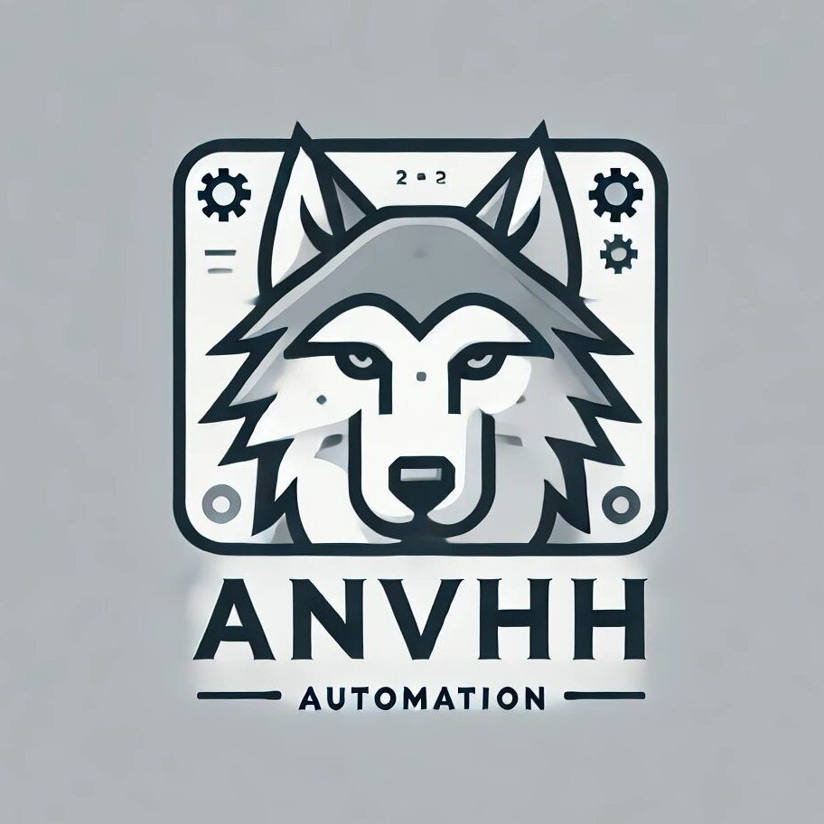

<p align='center'>
  
</p>

<h6 align='center'>
<a href="https://github.com/DaniilKimlb/anvhh-telegram-bot">GitHub Repository</a>
</h6>

<h5 align='center'>
<b>ANVHH - Telegram-бот для взаимодействия с API HeadHunter</b>
</h5>

---

> [!CAUTION]
> Перед началом работы убедитесь, что у вас есть необходимые переменные окружения, описанные ниже, и установлены все зависимости.

Telegram-бот предоставляет автоматизацию поиска вакансий, откликов и взаимодействия с API HeadHunter. Бот упрощает процесс поиска работы и управления вакансиями.

---

## **Установка**

> [!WARNING]
> Перед началом убедитесь, что у вас установлен Python 3.8 или выше.

1. Склонируйте репозиторий:

   ```bash
   git clone <repository_url>
   cd <repository_directory>
   ```

2. Установите зависимости:

   ```bash
   pip install -r requirements.txt
   ```

3. Создайте файл `.env` в корне проекта со следующим содержимым:

   ```env
   DATABASE_URL=your_database_url
   BOT_TOKEN=your_telegram_bot_token
   CLIENT_ID=your_hh_client_id
   CLIENT_SECRET=your_hh_client_secret
   BASE_URL=https://api.hh.kz
   USER_AGENT=YourAppName
   REDIRECT_URI=https://your_redirect_uri
   ENCRYPTION_KEY=your_encryption_key
   ```

4. Запустите бота:
   ```bash
   python app.py
   ```

---

## **Основные возможности**

1. **Авторизация через HeadHunter API**  
   Бот запрашивает разрешение на доступ к вашим вакансиям и резюме через OAuth.

2. **Автоматический отклик на вакансии**  
   Используйте ключевые слова и шаблоны для автоматизации откликов.

3. **Управление настройками**  
   Настраивайте резюме, ключевые слова и шаблоны прямо в Telegram.

4. **Удобный интерфейс**  
   Все функции доступны через Telegram-кнопки и меню.

5. **Сохранение данных**  
   Пользовательские настройки сохраняются в базе данных для дальнейшего использования.

---

## **Как взаимодействовать с ботом**

1. **Запустите бота**  
   В Telegram введите команду `/start`, чтобы начать работу с ботом.

2. **Авторизация**  
   Следуйте инструкциям для авторизации через HeadHunter:

   - Нажмите "🔑 Авторизоваться".
   - Перейдите по предоставленной ссылке.
   - Введите свои учетные данные HeadHunter.

3. **Настройка параметров**  
   Используйте меню настроек:

   - Выберите резюме для откликов.
   - Задайте ключевые слова для поиска вакансий.
   - Установите шаблон сопроводительного письма.

4. **Запуск поиска вакансий**  
   Выберите "🚀 Начать отклики на вакансии", чтобы бот начал поиск и отклик на подходящие вакансии.

---

## **Структура проекта**

- **`app.py`**  
  Запуск бота и регистрация обработчиков.

- **`bot_handlers.py`**  
  Обработка команд, сообщений и callback-запросов.

- **`config.py`**  
  Конфигурация проекта с использованием `.env`.

- **`db.py`**  
  Управление данными пользователей в PostgreSQL.

- **`hh.py`**  
  Класс для взаимодействия с API HeadHunter (запросы вакансий, резюме, отклики).

- **`message_builders.py`**  
  Создание интерфейса Telegram с помощью кнопок.

- **`user_models.py`**  
  Работа с пользовательскими настройками.

---

## **Примечания**

1. Убедитесь, что у вас корректно настроен файл `.env`.
2. При возникновении ошибок проверьте подключение к базе данных и правильность токена Telegram.

---

Если возникнут вопросы или предложения, создавайте [Issues](https://github.com/DaniilKimlb/anvhh-telegram-bot/issues)

**Ваш вклад важен!**
